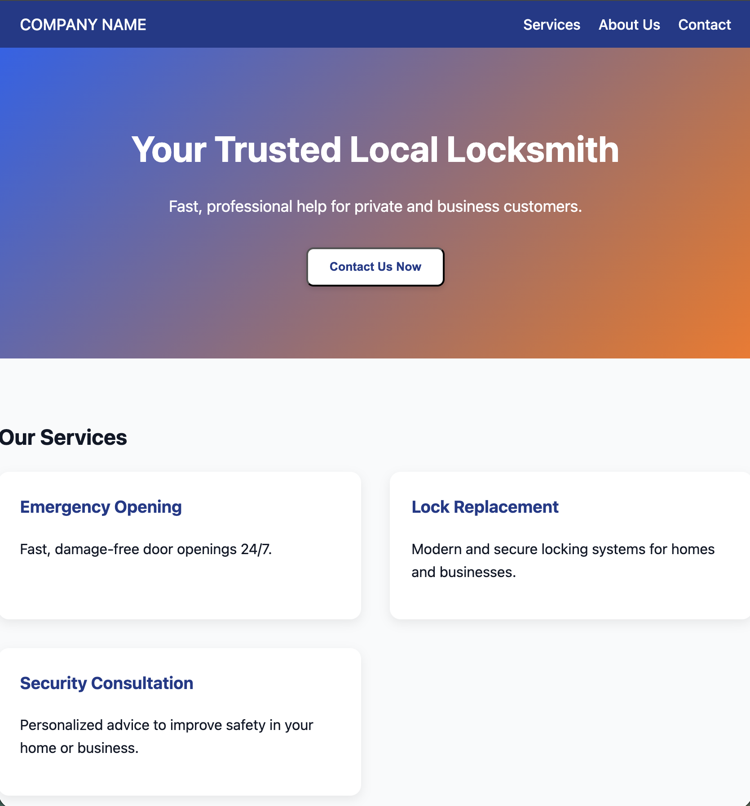
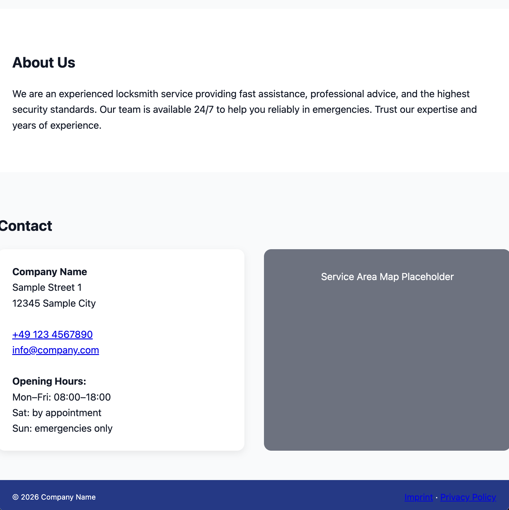

# Modern Company Website v0

## Description

A responsive, modern company website (v0 version). Perfect for portfolio, demo, or personal projects.

## Features

- Responsive grid layouts for services and contact section
- Hero section with call-to-action button
- Footer with dynamic current year
- Semantic HTML & CSS variables
- Mobile optimized (screens <480px)

## Tech Stack

- HTML5
- CSS3 (Grid, Flexbox, Variables)
- Vanilla JS (dynamic year)

## Preview

## Installation

1. Clone the repository
2. Open `index.html` in your browser

## Notes

- Placeholder content is used for demo purposes. Replace with real company information for production.
- The project demonstrates clean, modern, and responsive design principles.
